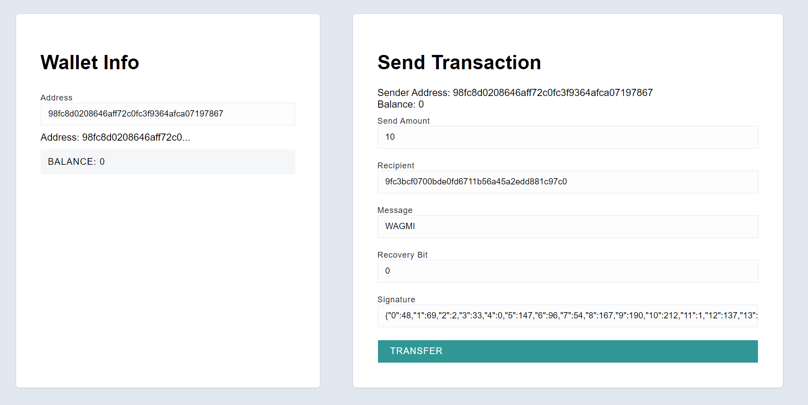

## Alchemy University Eth Dev Bootcamp Week 1 Project - ECDSA Node

This project allows a user to send a cryptographic signature, verifies that it belongs to the specific public key / address that the user is assumed to have the private key of, and then sends funds from that address to another once verified.

Yikes. Not being very experienced with React made this very hard. Non-React syntax struggle points were:

- Sending cryptographic signatures from client to server can be quite finicky. Thanks to [ynvygy](https://github.com/ynvygy) for sharing the code to work around the signature finicky-ness. The server did not like me sending the Uint8Array signature, so instead of passing that, I modified the "generate-key-and-sig" script to stringify the Uint8Array, then that is what the user inputs into the Wallet form. This gets sent to the server where it gets parsed into a regular array, and then converted back into the Uint8Array for use in the `secp.recoverPublicKey()` method.
- The `js-ethereum-cryptography` library is such a great all-in-one-place tool, but it doesn't explicitly state that the recovery bit can be any number you want. It just needs to be the same number when you're making the signature (`secp.sign()`)and when you're recovering the public key (`secp.recoverPublicKey()`).

Screenshot of App:

## Original ECDSA Node Instructions from Alchemy

This project is an example of using a client and server to facilitate transfers between different addresses. Since there is just a single server on the back-end handling transfers, this is clearly very centralized. We won't worry about distributed consensus for this project.

However, something that we would like to incoporate is Public Key Cryptography. By using Elliptic Curve Digital Signatures we can make it so the server only allows transfers that have been signed for by the person who owns the associated address.

### Video instructions

For an overview of this project as well as getting started instructions, check out the following video:

https://www.loom.com/share/0d3c74890b8e44a5918c4cacb3f646c4

### Client

The client folder contains a [react app](https://reactjs.org/) using [vite](https://vitejs.dev/). To get started, follow these steps:

1. Open up a terminal in the `/client` folder
2. Run `npm install` to install all the depedencies
3. Run `npm run dev` to start the application
4. Now you should be able to visit the app at http://127.0.0.1:5173/

### Server

The server folder contains a node.js server using [express](https://expressjs.com/). To run the server, follow these steps:

1. Open a terminal within the `/server` folder
2. Run `npm install` to install all the depedencies
3. Run `node index` to start the server
   The application should connect to the default server port (3042) automatically!
   _Hint_ - Use [nodemon](https://www.npmjs.com/package/nodemon) instead of `node` to automatically restart the server on any changes.

Your Goal: ECDSA
This project begins with a client that is allowed to transfer any funds from any account to another account. That's not very secure. By applying digital signatures we can require that only the user with the appropriate private key can create a signature that will allow them to move funds from one account to the other. Then, the server can verify the signature to move funds from one account to another.

A. Incorporate Public Key Cryptography so transfers can only be completed with a valid signature
B. The person sending the transaction should have to verify that they own the private key corresponding to the address that is sending funds
